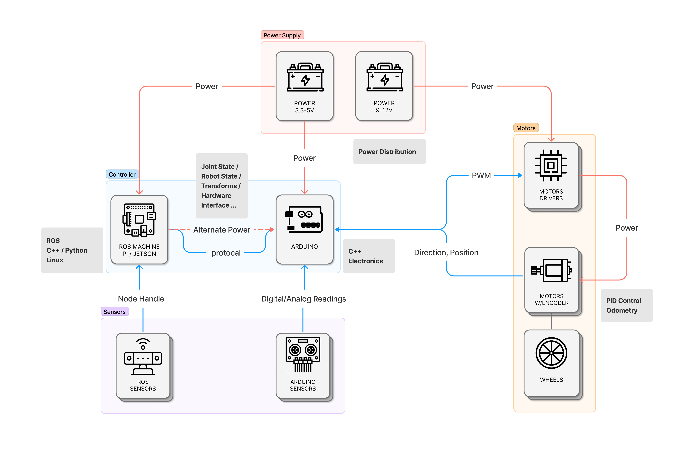
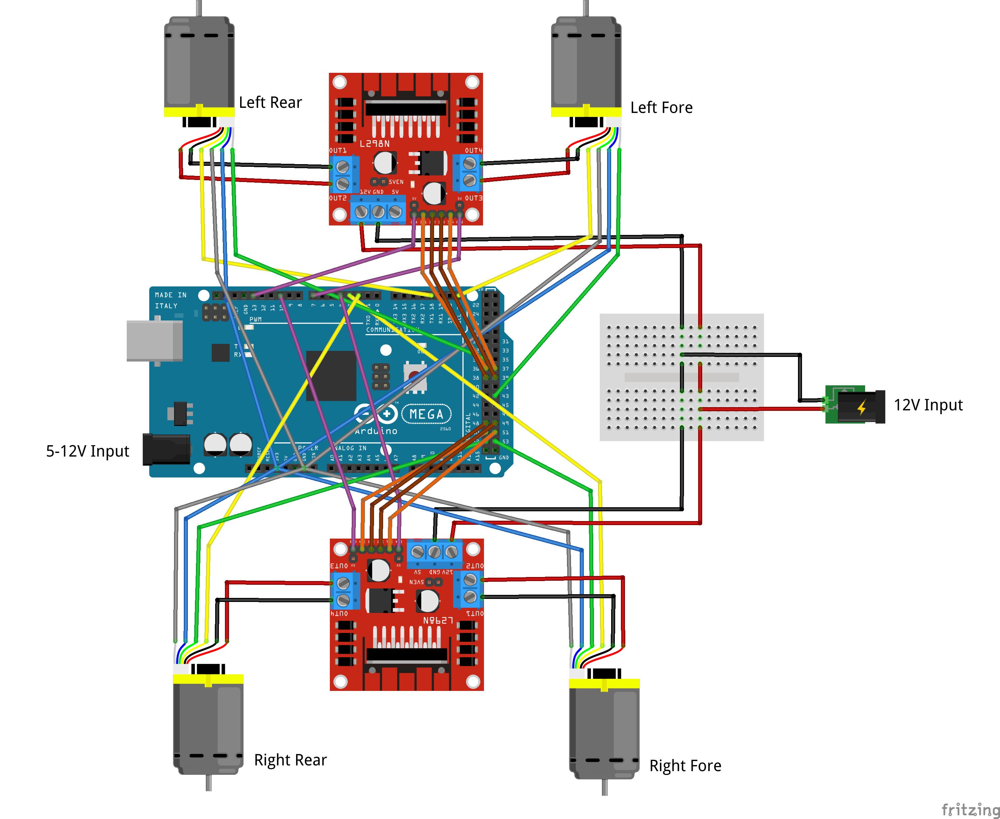

# Hinatomaru - A Mobile Robot for Material Handling in Prefabricated Housing Factory (Ongoing)

## I. Introduction

The project Hinatomaru explores the automation opportunities in the Prefabricated Housing factories. The industry in the U.S. aims to manufacture affordable modular housing products, such that factories don't have enough profits to invest in automating the manufacturing process on a large scale. This project aims to find a practical way to automate several tasks to increase manufacturing efficiency without affecting the factories' current layout and production. 

The proposed scheme uses the mobile robot to assist in material handling tasks, mainly material transporting and delivering.

    
    
    
Picking up and delivering materials

## II. System Diagram

The robot consists of four major parts: power supplies, motors, controllers, and sensors. 
- **Power Supply**: There are two power sources in the system; a 5V one powers the ROS machine and Arduino controller, and a 12V one powers four DC motors;
- **Motors**: Two L298N motor drivers controlling four 50:1 DC motors; each motor drives a Mecanum wheel and can operate independently;
- **Controller**: Now selecting Jeston Nano 4Gb as the ROS controller, and Arduino Mega as the sensor and motor controller.
- **Sensors**: Waiting to be updated 

    
    
The system diagram

## III. Circuit Diagram

I choose Arduino Mega as motor/sensor controller. The robot uses four Mecanum wheels, I installed two L298N motor drivers; each driver controls two motors on the same side.

    
    
The circuit diagram

## IV. Current State:

Following images showing the current progress of the robot. 

    
    

    
    

